# 🐣 S1 | Prog: Workshop

Template de projet pour le workshop de prog des Imac1. Vous trouverez le sujet ici: https://dsmte.github.io/Learn--cpp_programming/Workshop

## ⭐ Ne garder que le vert

Enlever la couleur rouge et bleu

## ⭐ Échanger les canaux

Switch les couleurs rouges et bleus

## ⭐ Noir & Blanc

Passer en noir et blanc l'image grâce à la luminance

## ⭐ Négatif

Passage de la couleur de base au négatif en soustrayant par 1

## ⭐ Dégradé

Dégradé du noir au blanc grâce à la coordonnée en x

## ⭐⭐ Miroir

On enregistre les pixels, et on parcours la moitié de l'image, en mettant les anciens pixels au bout de l'image et les pixels de la fin au début.

## ⭐⭐ Image bruitée

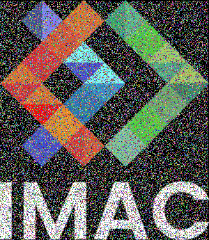

On colorise des pixels aléatoires

## ⭐⭐ Rotation de 90°

Un petit peu de galère à trouver la bonne rotation, mais j'ai réussi !

## ⭐⭐ RGB split

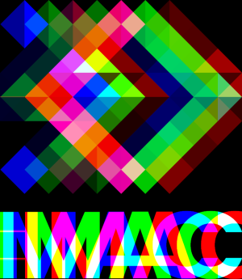

offset pour décaler les pixels de couleurs, je connaissais pas encore le clamp là, donc j'ai fait avec des conditions

## ⭐⭐ Luminosité

J'ai mis en commentaire pour éclaircir

## ⭐⭐(⭐) Disque

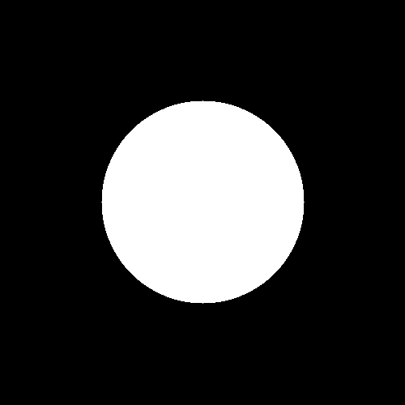

Utiliser la formule du cercle

## ⭐ Cercle

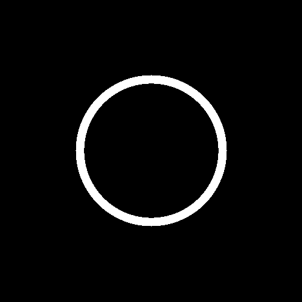

Doubler le disque

## ⭐⭐ Animation

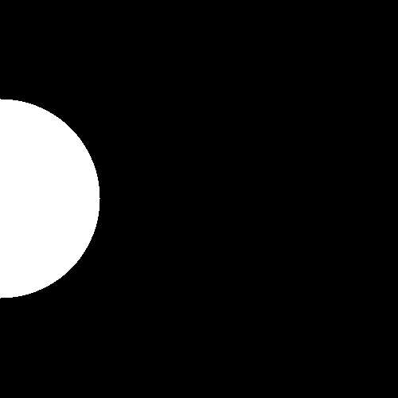

## ⭐⭐⭐ Rosace

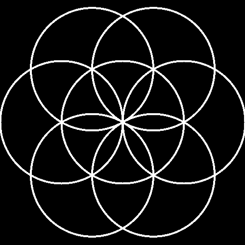

Pour la rosace, j'ai fait quelques tests comme ci-dessous :

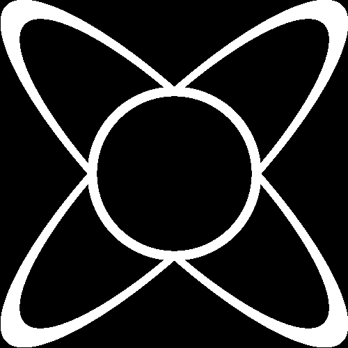
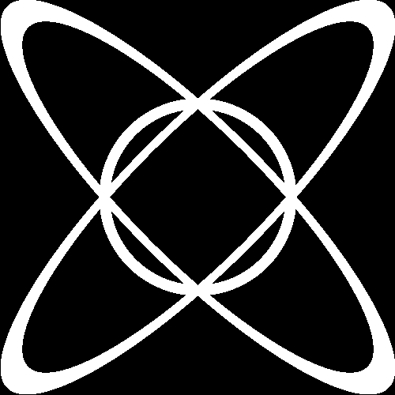

ça rend des choses un peu stylé

## ⭐⭐ Mosaïque

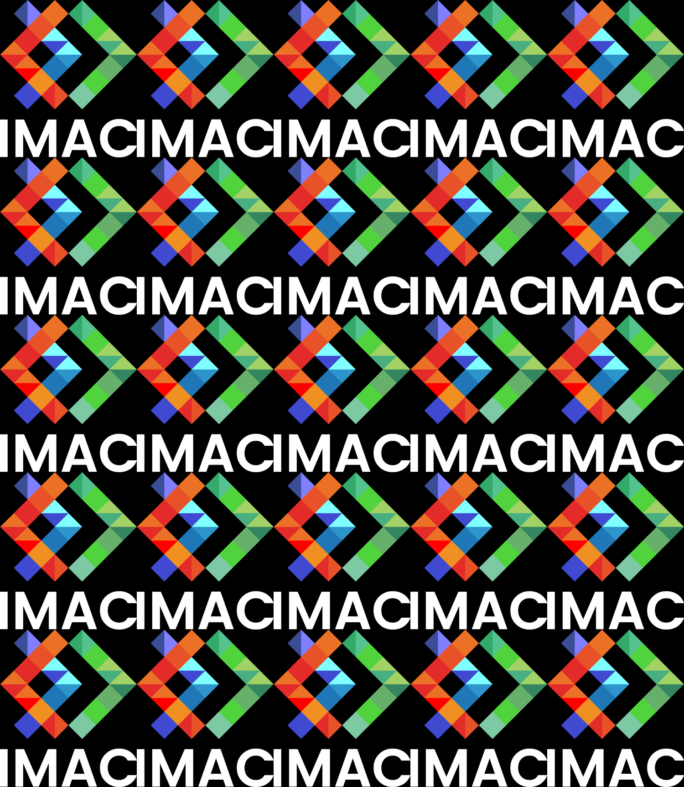

## ⭐⭐⭐⭐ Mosaïque miroir

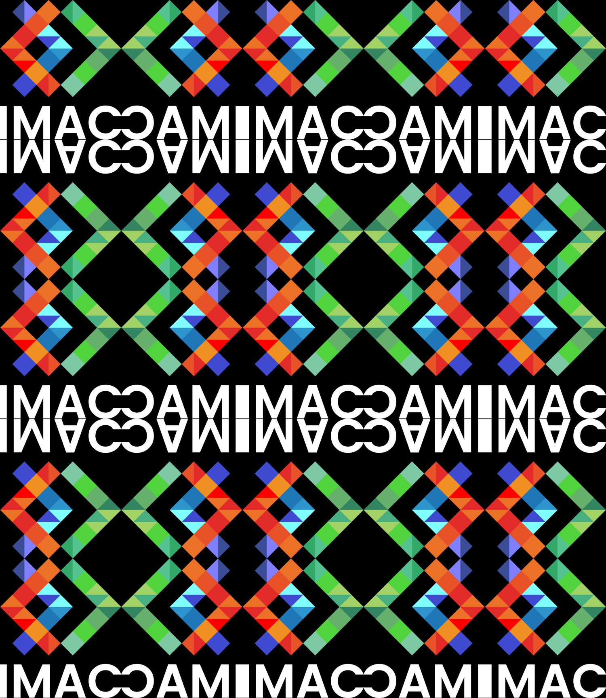

Un peu de galère à refaire les effets de mirroir surtout pour l'abscisse, mais avec du modulo ça passe

## ⭐⭐⭐ Glitch

On vérifie juste que l'effet glitch ne sorte pas de l'image, et c'est ok

## ⭐⭐⭐ Tri de pixels

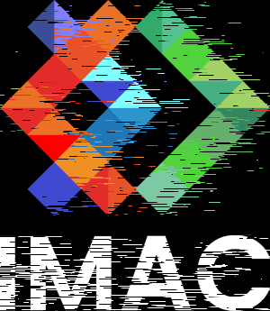

On fait le tri en fonction de la luminance de l'image (en faisant attention de ne pas sortir l'effet de l'image)

## ⭐⭐⭐(⭐) Fractale de Mandelbrot

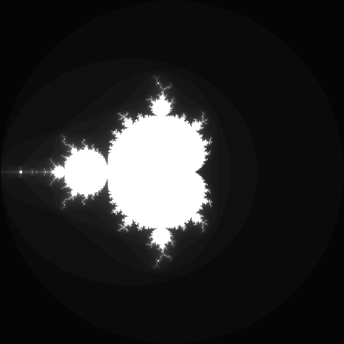

J'ai du m'aider un peu d'internet pour bien comprendre comment marchait la fractale (en particulier le coup de l'interval -2 à 2)

## ⭐⭐⭐(⭐) Dégradés dans l'espace de couleur Lab

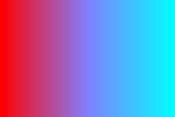

Passage de Srgb à linear puis oklab et faire le chemin inverse, j'ai pu utiliser deux fonctions que j'ai codé pour le srgb à linear et inversement

## ⭐⭐⭐(⭐) Tramage

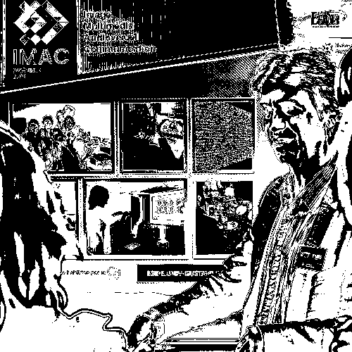

Un peu de temps à comprendre l'algo, mais c'est passé (avec un petit fail pour la première image)

## ⭐⭐⭐(⭐) Normalisation de l'histogramme

On récupère la plus petite luminance et la plus grande, et on l'assigne à l'interval 0 ; 1

## ⭐⭐⭐⭐ Vortex

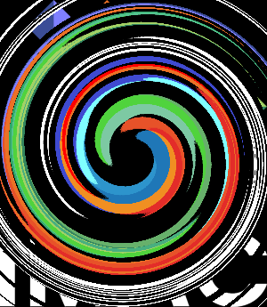

On prend un pixel et celui du centre de l'image, et on le fait tourner en fonction d'un angle définit et de la distance point / centre.

## ⭐⭐⭐⭐ Convolutions

Merci à la méthode clamp pour ne pas sortir de l'image ! (ça m'a surtotu été utile pour les coins)

## ⭐ Netteté, Contours, etc

On définit d'autre matrice et on utilise la fonction de la convolution

## ⭐⭐ Filtres séparables

Je me suis basé sur la fonction de convolution. Je fais d'abord un passage pour les lignes, puis pour les colonnes (ce qui demande de changer aussi le kernel, de 1/9 on passe à 1/3)